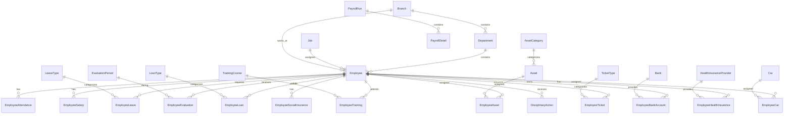

# تصميم إعادة هيكلة نظام الموارد البشرية إلى تطبيقات منفصلة

## نظرة عامة

سيتم إعادة تصميم نظام الموارد البشرية ليصبح مجموعة من التطبيقات المنفصلة والمتخصصة، بحيث يكون كل تطبيق مسؤولاً عن جانب محدد من جوانب إدارة الموارد البشرية. سيتم بناء النظام على Django 4.2+ مع SQL Server كقاعدة بيانات أساسية، مع دعم كامل للغة العربية ونظام RTL.

## الهيكل المعماري

### التطبيقات الأساسية

```
ElDawliya_sys/
├── employees/          # إدارة بيانات الموظفين الأساسية
├── attendance/         # الحضور والانصراف
├── leaves/            # الإجازات
├── evaluations/       # التقييمات
├── payrolls/          # الرواتب
├── insurance/         # التأمينات
├── cars/              # السيارات
├── loans/             # القروض
├── training/          # التدريب
├── disciplinary/      # الإجراءات التأديبية
├── assets/            # الأصول
├── tickets/           # التذاكر
├── banks/             # البنوك
├── rbac/              # إدارة المستخدمين والصلاحيات
├── notifications/     # الإشعارات (موجود مسبقاً)
├── audit/             # التدقيق (موجود مسبقاً)
└── core/              # الوظائف المشتركة
```

### قاعدة البيانات

سيتم استخدام قاعدة البيانات المحددة مسبقاً والتي تحتوي على 27 جدولاً:

#### الجداول الأساسية
- `SysSettings` - الإعدادات العامة
- `Branches` - الأفرع
- `Departments` - الأقسام
- `Jobs` - الوظائف
- `Employees` - بيانات الموظفين

#### جداول الحضور والإجازات
- `AttendanceRules` - قواعد الحضور
- `EmployeeAttendance` - سجلات الحضور
- `LeaveTypes` - أنواع الإجازات
- `EmployeeLeaves` - طلبات الإجازات

#### جداول الرواتب والمالية
- `EmployeeSalaries` - رواتب الموظفين
- `PayrollRuns` - دورات الرواتب
- `PayrollDetails` - تفاصيل الرواتب
- `LoanTypes` - أنواع القروض
- `EmployeeLoans` - قروض الموظفين
- `LoanInstallments` - أقساط القروض

#### جداول التأمينات والخدمات
- `HealthInsuranceProviders` - مقدمي التأمين الصحي
- `EmployeeHealthInsurance` - التأمين الصحي للموظفين
- `EmployeeSocialInsurance` - التأمين الاجتماعي
- `Banks` - البنوك
- `EmployeeBankAccounts` - الحسابات البنكية

#### جداول التقييم والتدريب
- `EvaluationPeriods` - فترات التقييم
- `EmployeeEvaluations` - تقييمات الموظفين
- `TrainingProviders` - مقدمي التدريب
- `TrainingCourses` - الدورات التدريبية
- `EmployeeTraining` - تدريب الموظفين

#### جداول الأصول والخدمات
- `Cars` - السيارات
- `EmployeeCars` - سيارات الموظفين
- `AssetCategories` - فئات الأصول
- `Assets` - الأصول
- `EmployeeAssets` - أصول الموظفين
- `TicketTypes` - أنواع التذاكر
- `EmployeeTickets` - تذاكر الموظفين

#### جداول النظام
- `Users` - المستخدمين
- `Roles` - الأدوار
- `Permissions` - الصلاحيات
- `RolePermissions` - صلاحيات الأدوار
- `UserRoles` - أدوار المستخدمين
- `Notifications` - الإشعارات
- `AuditLog` - سجل التدقيق
- `PublicHolidays` - العطلات الرسمية
- `EmployeeDocuments` - وثائق الموظفين
- `DisciplinaryActions` - الإجراءات التأديبية
- `ExitInterviews` - مقابلات الخروج
- `EmailTemplates` - قوالب البريد الإلكتروني
- `SMSLog` - سجل الرسائل النصية
- `WorkflowSteps` - خطوات سير العمل
- `WorkflowInstances` - حالات سير العمل

## المكونات والواجهات

### 1. تطبيق الموظفين (employees)

#### النماذج
```python
class Branch(models.Model):
    branch_id = models.AutoField(primary_key=True)
    branch_name = models.CharField(max_length=150)
    branch_address = models.TextField(blank=True)
    phone = models.CharField(max_length=50, blank=True)
    manager = models.ForeignKey('Employee', null=True, blank=True)
    is_active = models.BooleanField(default=True)

class Department(models.Model):
    dept_id = models.AutoField(primary_key=True)
    dept_name = models.CharField(max_length=150)
    parent_dept = models.ForeignKey('self', null=True, blank=True)
    branch = models.ForeignKey(Branch)
    manager = models.ForeignKey('Employee', null=True, blank=True)
    is_active = models.BooleanField(default=True)

class Job(models.Model):
    job_id = models.AutoField(primary_key=True)
    job_title = models.CharField(max_length=150)
    job_level = models.IntegerField(null=True, blank=True)
    basic_salary = models.DecimalField(max_digits=18, decimal_places=2, null=True)
    description = models.TextField(blank=True)
    is_active = models.BooleanField(default=True)

class Employee(models.Model):
    emp_id = models.AutoField(primary_key=True)
    emp_code = models.CharField(max_length=20, unique=True)
    first_name = models.CharField(max_length=100)
    second_name = models.CharField(max_length=100, blank=True)
    third_name = models.CharField(max_length=100, blank=True)
    last_name = models.CharField(max_length=100)
    gender = models.CharField(max_length=1, choices=[('M', 'ذكر'), ('F', 'أنثى')])
    birth_date = models.DateField(null=True, blank=True)
    nationality = models.CharField(max_length=50, blank=True)
    national_id = models.CharField(max_length=20, blank=True)
    passport_no = models.CharField(max_length=20, blank=True)
    mobile = models.CharField(max_length=50, blank=True)
    email = models.EmailField(blank=True)
    address = models.TextField(blank=True)
    hire_date = models.DateField(null=True, blank=True)
    join_date = models.DateField(null=True, blank=True)
    probation_end = models.DateField(null=True, blank=True)
    job = models.ForeignKey(Job)
    department = models.ForeignKey(Department)
    branch = models.ForeignKey(Branch)
    manager = models.ForeignKey('self', null=True, blank=True)
    emp_status = models.CharField(max_length=30, default='Active')
    termination_date = models.DateField(null=True, blank=True)
    notes = models.TextField(blank=True)
    photo = models.BinaryField(null=True, blank=True)
    created_at = models.DateTimeField(auto_now_add=True)
    updated_at = models.DateTimeField(auto_now=True)
```

#### الواجهات
- قائمة الموظفين مع البحث والفلترة
- نموذج إضافة/تعديل موظف
- عرض تفاصيل الموظف
- إدارة الأقسام والوظائف والأفرع

### 2. تطبيق الحضور (attendance)

#### النماذج
```python
class AttendanceRule(models.Model):
    rule_id = models.AutoField(primary_key=True)
    rule_name = models.CharField(max_length=100)
    shift_start = models.TimeField()
    shift_end = models.TimeField()
    late_threshold = models.IntegerField()  # بالدقائق
    early_threshold = models.IntegerField()
    overtime_start_after = models.TimeField()
    weekend_days = models.CharField(max_length=20)  # Fri,Sat
    is_default = models.BooleanField(default=False)

class EmployeeAttendance(models.Model):
    att_id = models.BigAutoField(primary_key=True)
    employee = models.ForeignKey('employees.Employee')
    att_date = models.DateField()
    check_in = models.DateTimeField(null=True, blank=True)
    check_out = models.DateTimeField(null=True, blank=True)
    status = models.CharField(max_length=20)  # Present, Absent, Late, EarlyLeave
    rule = models.ForeignKey(AttendanceRule, null=True, blank=True)
```

#### الواجهات
- تسجيل الحضور والانصراف
- تقارير الحضور اليومية والشهرية
- إدارة قواعد الحضور
- تقرير التأخير والوقت الإضافي

### 3. تطبيق الإجازات (leaves)

#### النماذج
```python
class LeaveType(models.Model):
    leave_type_id = models.AutoField(primary_key=True)
    leave_name = models.CharField(max_length=100)
    max_days_per_year = models.IntegerField(null=True, blank=True)
    is_paid = models.BooleanField()

class EmployeeLeave(models.Model):
    leave_id = models.AutoField(primary_key=True)
    employee = models.ForeignKey('employees.Employee')
    leave_type = models.ForeignKey(LeaveType)
    start_date = models.DateField()
    end_date = models.DateField()
    reason = models.TextField(blank=True)
    status = models.CharField(max_length=30, default='Pending')
    approved_by = models.ForeignKey('employees.Employee', related_name='approved_leaves', null=True)
    approved_date = models.DateTimeField(null=True, blank=True)
```

#### الواجهات
- طلب إجازة جديدة
- مراجعة واعتماد طلبات الإجازات
- تقرير أرصدة الإجازات
- تقرير الإجازات المستخدمة

### 4. تطبيق التقييمات (evaluations)

#### النماذج
```python
class EvaluationPeriod(models.Model):
    period_id = models.AutoField(primary_key=True)
    period_name = models.CharField(max_length=100)
    start_date = models.DateField()
    end_date = models.DateField()

class EmployeeEvaluation(models.Model):
    eval_id = models.AutoField(primary_key=True)
    employee = models.ForeignKey('employees.Employee')
    period = models.ForeignKey(EvaluationPeriod)
    manager = models.ForeignKey('employees.Employee', related_name='evaluations_given', null=True)
    score = models.DecimalField(max_digits=5, decimal_places=2, null=True)
    notes = models.TextField(blank=True)
    eval_date = models.DateField(null=True, blank=True)
```

#### الواجهات
- إنشاء فترات التقييم
- تقييم الموظفين
- تقارير التقييمات
- مقارنة الأداء

### 5. تطبيق الرواتب (payrolls)

#### النماذج
```python
class EmployeeSalary(models.Model):
    salary_id = models.AutoField(primary_key=True)
    employee = models.ForeignKey('employees.Employee')
    basic_salary = models.DecimalField(max_digits=18, decimal_places=2, null=True)
    housing_allow = models.DecimalField(max_digits=18, decimal_places=2, null=True)
    transport = models.DecimalField(max_digits=18, decimal_places=2, null=True)
    other_allow = models.DecimalField(max_digits=18, decimal_places=2, null=True)
    gosi_deduction = models.DecimalField(max_digits=18, decimal_places=2, null=True)
    tax_deduction = models.DecimalField(max_digits=18, decimal_places=2, null=True)
    currency = models.CharField(max_length=3, default='SAR')
    effective_date = models.DateField()
    end_date = models.DateField(null=True, blank=True)
    is_current = models.BooleanField(default=True)

class PayrollRun(models.Model):
    run_id = models.AutoField(primary_key=True)
    run_date = models.DateField()
    month_year = models.CharField(max_length=7)  # 2025-07
    status = models.CharField(max_length=30, default='Draft')
    confirmed_by = models.ForeignKey('employees.Employee', null=True)

class PayrollDetail(models.Model):
    payroll_detail_id = models.AutoField(primary_key=True)
    run = models.ForeignKey(PayrollRun)
    employee = models.ForeignKey('employees.Employee')
    basic_salary = models.DecimalField(max_digits=18, decimal_places=2, null=True)
    housing = models.DecimalField(max_digits=18, decimal_places=2, null=True)
    transport = models.DecimalField(max_digits=18, decimal_places=2, null=True)
    overtime = models.DecimalField(max_digits=18, decimal_places=2, null=True)
    gosi = models.DecimalField(max_digits=18, decimal_places=2, null=True)
    tax = models.DecimalField(max_digits=18, decimal_places=2, null=True)
    loan_deduction = models.DecimalField(max_digits=18, decimal_places=2, null=True)
    net_salary = models.DecimalField(max_digits=18, decimal_places=2, null=True)
    paid_date = models.DateField(null=True, blank=True)
```

#### الواجهات
- إعداد رواتب الموظفين
- تشغيل دورة الرواتب
- كشوف الرواتب
- تقارير الرواتب

## نماذج البيانات

### العلاقات بين التطبيقات



### استراتيجية المفاتيح الأساسية

- استخدام `AutoField` بدلاً من `UUID` للتوافق مع قاعدة البيانات الموجودة
- الحفاظ على أسماء الحقول كما هي في قاعدة البيانات
- استخدام `related_name` واضحة للعلاقات

## معالجة الأخطاء

### استراتيجية معالجة الأخطاء

1. **أخطاء التحقق من البيانات**
   - استخدام Django Forms للتحقق من البيانات
   - رسائل خطأ واضحة باللغة العربية
   - التحقق من القيود على مستوى قاعدة البيانات

2. **أخطاء العمليات التجارية**
   - التحقق من القواعد التجارية قبل الحفظ
   - استخدام Django Signals للتحقق من التبعيات
   - رسائل تحذيرية للمستخدم

3. **أخطاء النظام**
   - تسجيل الأخطاء في ملفات السجل
   - إشعار المسؤولين بالأخطاء الحرجة
   - صفحات خطأ مخصصة

### أمثلة على معالجة الأخطاء

```python
# في نموذج الموظف
def clean(self):
    if self.hire_date and self.birth_date:
        age = (self.hire_date - self.birth_date).days / 365.25
        if age < 18:
            raise ValidationError('عمر الموظف يجب أن يكون 18 سنة على الأقل')
    
    if self.probation_end and self.hire_date:
        if self.probation_end <= self.hire_date:
            raise ValidationError('تاريخ انتهاء فترة التجربة يجب أن يكون بعد تاريخ التوظيف')

# في نموذج الإجازة
def clean(self):
    if self.start_date and self.end_date:
        if self.start_date > self.end_date:
            raise ValidationError('تاريخ بداية الإجازة يجب أن يكون قبل تاريخ النهاية')
        
        # التحقق من تداخل الإجازات
        overlapping = EmployeeLeave.objects.filter(
            employee=self.employee,
            start_date__lte=self.end_date,
            end_date__gte=self.start_date
        ).exclude(pk=self.pk)
        
        if overlapping.exists():
            raise ValidationError('يوجد تداخل مع إجازة أخرى')
```

## استراتيجية الاختبار

### أنواع الاختبارات

1. **اختبارات الوحدة (Unit Tests)**
   - اختبار النماذج والتحقق من البيانات
   - اختبار الوظائف المساعدة
   - اختبار العمليات الحسابية

2. **اختبارات التكامل (Integration Tests)**
   - اختبار التفاعل بين التطبيقات
   - اختبار سير العمل الكامل
   - اختبار API endpoints

3. **اختبارات الواجهة (UI Tests)**
   - اختبار النماذج والتفاعل
   - اختبار التنقل والروابط
   - اختبار الاستجابة على الأجهزة المختلفة

### أمثلة على الاختبارات

```python
# اختبار نموذج الموظف
class EmployeeModelTest(TestCase):
    def setUp(self):
        self.branch = Branch.objects.create(branch_name='الفرع الرئيسي')
        self.department = Department.objects.create(
            dept_name='تقنية المعلومات',
            branch=self.branch
        )
        self.job = Job.objects.create(
            job_title='مطور برمجيات',
            basic_salary=5000.00
        )
    
    def test_employee_creation(self):
        employee = Employee.objects.create(
            emp_code='EMP001',
            first_name='أحمد',
            last_name='محمد',
            job=self.job,
            department=self.department,
            branch=self.branch
        )
        self.assertEqual(employee.emp_code, 'EMP001')
        self.assertEqual(str(employee), 'أحمد محمد')
    
    def test_employee_age_validation(self):
        with self.assertRaises(ValidationError):
            employee = Employee(
                emp_code='EMP002',
                first_name='سارة',
                last_name='أحمد',
                birth_date=date.today() - timedelta(days=365*16),  # 16 سنة
                hire_date=date.today(),
                job=self.job,
                department=self.department,
                branch=self.branch
            )
            employee.full_clean()

# اختبار تطبيق الإجازات
class LeaveApplicationTest(TestCase):
    def setUp(self):
        # إعداد البيانات الأساسية
        pass
    
    def test_leave_request_workflow(self):
        # اختبار سير عمل طلب الإجازة
        pass
    
    def test_leave_balance_calculation(self):
        # اختبار حساب رصيد الإجازات
        pass
```

## الأمان والصلاحيات

### نظام الصلاحيات

```python
# صلاحيات على مستوى التطبيق
PERMISSIONS = {
    'employees': [
        'view_employee',
        'add_employee', 
        'change_employee',
        'delete_employee',
        'view_employee_salary',
        'change_employee_salary'
    ],
    'attendance': [
        'view_attendance',
        'add_attendance',
        'change_attendance',
        'view_attendance_reports'
    ],
    'leaves': [
        'view_leave',
        'add_leave',
        'approve_leave',
        'reject_leave'
    ],
    # ... باقي التطبيقات
}

# أدوار النظام
ROLES = {
    'hr_manager': [
        'employees.*',
        'leaves.approve_leave',
        'payrolls.*',
        'evaluations.*'
    ],
    'employee': [
        'employees.view_employee',
        'leaves.add_leave',
        'attendance.view_attendance'
    ],
    'supervisor': [
        'employees.view_employee',
        'attendance.*',
        'leaves.approve_leave',
        'evaluations.add_evaluation'
    ]
}
```

### حماية البيانات

1. **تشفير البيانات الحساسة**
   - تشفير أرقام الهوية وجوازات السفر
   - تشفير الرواتب والمعلومات المالية
   - تشفير كلمات المرور

2. **تسجيل العمليات**
   - تسجيل جميع عمليات الإنشاء والتعديل والحذف
   - تسجيل محاولات الوصول غير المصرح
   - تسجيل تغييرات الصلاحيات

3. **التحقق من الهوية**
   - استخدام Django Authentication
   - دعم المصادقة الثنائية
   - انتهاء صلاحية الجلسات

## التكامل مع الأنظمة الخارجية

### أجهزة الحضور والانصراف

```python
# خدمة تكامل أجهزة الحضور
class AttendanceDeviceService:
    def sync_attendance_data(self):
        # سحب البيانات من أجهزة الحضور
        pass
    
    def push_employee_data(self):
        # دفع بيانات الموظفين للأجهزة
        pass
```

### نظام المحاسبة

```python
# خدمة تصدير بيانات الرواتب
class PayrollExportService:
    def export_to_accounting_system(self, payroll_run):
        # تصدير بيانات الرواتب لنظام المحاسبة
        pass
```

### خدمات الإشعارات

```python
# خدمة الإشعارات
class NotificationService:
    def send_email_notification(self, recipient, template, context):
        # إرسال إشعار بريد إلكتروني
        pass
    
    def send_sms_notification(self, phone, message):
        # إرسال رسالة نصية
        pass
```

## الأداء والتحسين

### استراتيجيات التحسين

1. **تحسين قاعدة البيانات**
   - إنشاء فهارس على الحقول المستخدمة في البحث
   - استخدام `select_related` و `prefetch_related`
   - تحسين الاستعلامات المعقدة

2. **التخزين المؤقت**
   - تخزين التقارير المعقدة مؤقتاً
   - تخزين بيانات الموظفين الأساسية
   - استخدام Redis للتخزين المؤقت

3. **تحسين الواجهة**
   - تحميل البيانات بشكل تدريجي
   - استخدام AJAX للعمليات السريعة
   - ضغط الملفات الثابتة

### مراقبة الأداء

```python
# مراقبة أداء الاستعلامات
import logging
from django.db import connection

class QueryCountDebugMiddleware:
    def __init__(self, get_response):
        self.get_response = get_response

    def __call__(self, request):
        queries_before = len(connection.queries)
        response = self.get_response(request)
        queries_after = len(connection.queries)
        
        if queries_after - queries_before > 10:
            logging.warning(f'High query count: {queries_after - queries_before} queries for {request.path}')
        
        return response
```

## النشر والصيانة

### استراتيجية النشر

1. **البيئات**
   - بيئة التطوير (Development)
   - بيئة الاختبار (Testing)
   - بيئة الإنتاج (Production)

2. **النسخ الاحتياطية**
   - نسخ احتياطية يومية لقاعدة البيانات
   - نسخ احتياطية للملفات المرفوعة
   - اختبار دوري لاستعادة البيانات

3. **المراقبة**
   - مراقبة أداء الخادم
   - مراقبة أخطاء التطبيق
   - تنبيهات للمشاكل الحرجة

### خطة الصيانة

1. **الصيانة الدورية**
   - تحديث Django والمكتبات
   - تنظيف ملفات السجل القديمة
   - تحسين قاعدة البيانات

2. **الصيانة الطارئة**
   - خطة للتعامل مع الأعطال
   - نقاط اتصال للدعم الفني
   - إجراءات الاستعادة السريعة