# مخطط النماذج المحسنة لنظام الموارد البشرية

## الهيكل العام للنماذج

```mermaid
erDiagram
    Company ||--o{ Branch : has
    Company ||--o{ Department : has
    Branch ||--o{ Department : contains
    Department ||--o{ JobPosition : has
    JobPosition ||--o{ Employee : employs
    Employee ||--o{ Employee : manages
    
    Company {
        uuid id PK
        string name
        string legal_name
        string tax_id
        string registration_number
        string email
        string phone
        text address
        string city
        string country
        json hr_settings
        json payroll_settings
        json leave_settings
        boolean is_active
        datetime created_at
        datetime updated_at
    }
    
    Branch {
        uuid id PK
        uuid company_id FK
        string name
        string code
        string email
        string phone
        text address
        string city
        string state
        string country
        decimal latitude
        decimal longitude
        uuid manager_id FK
        time opening_time
        time closing_time
        json branch_settings
        boolean is_active
        boolean is_headquarters
        datetime created_at
        datetime updated_at
    }
    
    Department {
        uuid id PK
        uuid company_id FK
        uuid branch_id FK
        uuid parent_department_id FK
        string name
        string code
        text description
        uuid manager_id FK
        uuid assistant_manager_id FK
        string email
        string phone
        string department_type
        integer level
        json department_settings
        json annual_goals
        json kpis
        boolean is_active
        datetime created_at
        datetime updated_at
    }
    
    JobPosition {
        uuid id PK
        uuid department_id FK
        string title
        string code
        string title_english
        text description
        text requirements
        text responsibilities
        json skills_required
        string minimum_education
        string preferred_education
        integer minimum_experience_years
        integer preferred_experience_years
        integer level
        uuid reports_to FK
        string employment_type
        decimal min_salary
        decimal max_salary
        string currency
        json benefits
        integer working_hours_per_week
        boolean travel_required
        boolean remote_work_allowed
        boolean overtime_eligible
        json kpis
        json performance_goals
        json job_settings
        integer max_headcount
        integer current_headcount
        boolean is_active
        boolean is_critical
        datetime created_at
        datetime updated_at
    }
    
    Employee {
        uuid id PK
        string employee_number UK
        uuid company_id FK
        uuid branch_id FK
        uuid department_id FK
        uuid job_position_id FK
        uuid manager_id FK
        string first_name
        string middle_name
        string last_name
        string full_name
        string full_name_english
        string email UK
        string personal_email
        string phone
        string mobile
        string national_id UK
        string passport_number
        date passport_expiry
        date birth_date
        string gender
        string marital_status
        string nationality
        string religion
        text address
        string city
        string state
        string country
        string postal_code
        date hire_date
        date probation_end_date
        date confirmation_date
        string employment_type
        string status
        decimal basic_salary
        string currency
        string bank_name
        string bank_account_number
        string iban
        string emergency_contact_name
        string emergency_contact_phone
        string emergency_contact_relationship
        image profile_picture
        uuid user_account_id FK
        text notes
        datetime created_at
        datetime updated_at
    }
```



## النماذج التفصيلية

### 1. النماذج الأساسية (Core Models)

#### Company (الشركة)
```python
class Company(models.Model):
    # معرف فريد
    id = models.UUIDField(primary_key=True, default=uuid.uuid4)
    
    # المعلومات الأساسية
    name = models.CharField(max_length=200, verbose_name="اسم الشركة")
    legal_name = models.CharField(max_length=200, verbose_name="الاسم القانوني")
    
    # معلومات التسجيل
    tax_id = models.CharField(max_length=50, unique=True, verbose_name="الرقم الضريبي")
    registration_number = models.CharField(max_length=50, verbose_name="رقم السجل التجاري")
    
    # معلومات الاتصال
    email = models.EmailField(verbose_name="البريد الإلكتروني")
    phone = models.CharField(max_length=20, verbose_name="رقم الهاتف")
    website = models.URLField(verbose_name="الموقع الإلكتروني")
    
    # معلومات العنوان
    address = models.TextField(verbose_name="العنوان")
    city = models.CharField(max_length=100, verbose_name="المدينة")
    country = models.CharField(max_length=100, default="مصر", verbose_name="الدولة")
    postal_code = models.CharField(max_length=20, verbose_name="الرمز البريدي")
    
    # العلامة التجارية
    logo = models.ImageField(upload_to='company_logos/', verbose_name="شعار الشركة")
    primary_color = models.CharField(max_length=7, default="#007bff", verbose_name="اللون الأساسي")
    secondary_color = models.CharField(max_length=7, default="#6c757d", verbose_name="اللون الثانوي")
    
    # معلومات العمل
    industry = models.CharField(max_length=100, verbose_name="نوع النشاط")
    established_date = models.DateField(verbose_name="تاريخ التأسيس")
    employee_count = models.PositiveIntegerField(default=0, verbose_name="عدد الموظفين")
    
    # إعدادات النظام
    timezone = models.CharField(max_length=50, default="Africa/Cairo", verbose_name="المنطقة الزمنية")
    currency = models.CharField(max_length=3, default="EGP", verbose_name="العملة")
    fiscal_year_start = models.DateField(verbose_name="بداية السنة المالية")
    
    # الإعدادات (JSON)
    hr_settings = models.JSONField(default=dict, verbose_name="إعدادات الموارد البشرية")
    payroll_settings = models.JSONField(default=dict, verbose_name="إعدادات الرواتب")
    leave_settings = models.JSONField(default=dict, verbose_name="إعدادات الإجازات")
    
    # الحالة والبيانات الوصفية
    is_active = models.BooleanField(default=True, verbose_name="نشط")
    created_at = models.DateTimeField(auto_now_add=True, verbose_name="تاريخ الإنشاء")
    updated_at = models.DateTimeField(auto_now=True, verbose_name="تاريخ التحديث")
```

#### Branch (الفرع)
```python
class Branch(models.Model):
    # معرف فريد
    id = models.UUIDField(primary_key=True, default=uuid.uuid4)
    
    # العلاقة مع الشركة
    company = models.ForeignKey('Company', on_delete=models.CASCADE, related_name='branches')
    
    # المعلومات الأساسية
    name = models.CharField(max_length=200, verbose_name="اسم الفرع")
    code = models.CharField(max_length=20, unique=True, verbose_name="كود الفرع")
    description = models.TextField(verbose_name="وصف الفرع")
    
    # معلومات الاتصال
    email = models.EmailField(verbose_name="البريد الإلكتروني")
    phone = models.CharField(max_length=20, verbose_name="رقم الهاتف")
    fax = models.CharField(max_length=20, verbose_name="رقم الفاكس")
    
    # معلومات العنوان
    address = models.TextField(verbose_name="العنوان")
    city = models.CharField(max_length=100, verbose_name="المدينة")
    state = models.CharField(max_length=100, verbose_name="المحافظة/الولاية")
    country = models.CharField(max_length=100, default="مصر", verbose_name="الدولة")
    postal_code = models.CharField(max_length=20, verbose_name="الرمز البريدي")
    
    # المعلومات الجغرافية
    latitude = models.DecimalField(max_digits=10, decimal_places=8, verbose_name="خط العرض")
    longitude = models.DecimalField(max_digits=11, decimal_places=8, verbose_name="خط الطول")
    
    # الإدارة
    manager = models.ForeignKey('Employee', on_delete=models.SET_NULL, null=True, related_name='managed_branches')
    
    # المعلومات التشغيلية
    opening_time = models.TimeField(verbose_name="وقت بداية العمل")
    closing_time = models.TimeField(verbose_name="وقت نهاية العمل")
    timezone = models.CharField(max_length=50, verbose_name="المنطقة الزمنية")
    
    # السعة والموارد
    employee_capacity = models.PositiveIntegerField(verbose_name="السعة القصوى للموظفين")
    floor_area = models.DecimalField(max_digits=10, decimal_places=2, verbose_name="المساحة")
    parking_spaces = models.PositiveIntegerField(verbose_name="عدد أماكن الانتظار")
    
    # المعلومات المالية
    monthly_rent = models.DecimalField(max_digits=12, decimal_places=2, verbose_name="الإيجار الشهري")
    monthly_utilities = models.DecimalField(max_digits=12, decimal_places=2, verbose_name="المرافق الشهرية")
    
    # إعدادات الفرع
    branch_settings = models.JSONField(default=dict, verbose_name="إعدادات الفرع")
    
    # الحالة والبيانات الوصفية
    is_active = models.BooleanField(default=True, verbose_name="نشط")
    is_headquarters = models.BooleanField(default=False, verbose_name="المقر الرئيسي")
    established_date = models.DateField(verbose_name="تاريخ التأسيس")
    created_at = models.DateTimeField(auto_now_add=True, verbose_name="تاريخ الإنشاء")
    updated_at = models.DateTimeField(auto_now=True, verbose_name="تاريخ التحديث")
```

### 2. نماذج الحضور والوقت

#### WorkShift (الوردية)
```python
class WorkShift(models.Model):
    # معرف فريد
    id = models.UUIDField(primary_key=True, default=uuid.uuid4)
    
    # العلاقة مع الشركة
    company = models.ForeignKey('Company', on_delete=models.CASCADE, related_name='work_shifts')
    
    # المعلومات الأساسية
    name = models.CharField(max_length=100, verbose_name="اسم الوردية")
    code = models.CharField(max_length=20, unique=True, verbose_name="كود الوردية")
    description = models.TextField(verbose_name="وصف الوردية")
    
    # أوقات العمل
    start_time = models.TimeField(verbose_name="وقت البداية")
    end_time = models.TimeField(verbose_name="وقت النهاية")
    break_start_time = models.TimeField(verbose_name="بداية الاستراحة")
    break_end_time = models.TimeField(verbose_name="نهاية الاستراحة")
    
    # إعدادات الوردية
    working_hours = models.DecimalField(max_digits=4, decimal_places=2, verbose_name="ساعات العمل")
    break_duration = models.PositiveIntegerField(verbose_name="مدة الاستراحة بالدقائق")
    
    # أيام العمل
    working_days = models.JSONField(default=list, verbose_name="أيام العمل")  # [1,2,3,4,5] للأحد-الخميس
    
    # إعدادات المرونة
    grace_period_minutes = models.PositiveIntegerField(default=15, verbose_name="فترة السماح بالدقائق")
    overtime_threshold_minutes = models.PositiveIntegerField(default=30, verbose_name="حد العمل الإضافي")
    
    # الحالة
    is_active = models.BooleanField(default=True, verbose_name="نشط")
    created_at = models.DateTimeField(auto_now_add=True, verbose_name="تاريخ الإنشاء")
    updated_at = models.DateTimeField(auto_now=True, verbose_name="تاريخ التحديث")
```

#### AttendanceRecord (سجل الحضور)
```python
class AttendanceRecord(models.Model):
    # معرف فريد
    id = models.UUIDField(primary_key=True, default=uuid.uuid4)
    
    # العلاقات
    employee = models.ForeignKey('Employee', on_delete=models.CASCADE, related_name='attendance_records')
    machine = models.ForeignKey('AttendanceMachine', on_delete=models.SET_NULL, null=True)
    
    # معلومات التسجيل
    date = models.DateField(verbose_name="التاريخ")
    check_in_time = models.DateTimeField(verbose_name="وقت الدخول")
    check_out_time = models.DateTimeField(null=True, verbose_name="وقت الخروج")
    
    # الحسابات
    total_hours = models.DecimalField(max_digits=5, decimal_places=2, null=True, verbose_name="إجمالي الساعات")
    regular_hours = models.DecimalField(max_digits=5, decimal_places=2, null=True, verbose_name="الساعات العادية")
    overtime_hours = models.DecimalField(max_digits=5, decimal_places=2, default=0, verbose_name="ساعات إضافية")
    break_hours = models.DecimalField(max_digits=5, decimal_places=2, default=0, verbose_name="ساعات الاستراحة")
    
    # الحالة
    status = models.CharField(max_length=20, choices=[
        ('present', 'حاضر'),
        ('late', 'متأخر'),
        ('absent', 'غائب'),
        ('half_day', 'نصف يوم'),
        ('on_leave', 'في إجازة'),
    ], verbose_name="الحالة")
    
    # ملاحظات
    notes = models.TextField(null=True, verbose_name="ملاحظات")
    
    # البيانات الوصفية
    created_at = models.DateTimeField(auto_now_add=True, verbose_name="تاريخ الإنشاء")
    updated_at = models.DateTimeField(auto_now=True, verbose_name="تاريخ التحديث")
```

### 3. نماذج الإجازات

#### LeaveType (نوع الإجازة)
```python
class LeaveType(models.Model):
    # معرف فريد
    id = models.UUIDField(primary_key=True, default=uuid.uuid4)
    
    # العلاقة مع الشركة
    company = models.ForeignKey('Company', on_delete=models.CASCADE, related_name='leave_types')
    
    # المعلومات الأساسية
    name = models.CharField(max_length=100, verbose_name="اسم نوع الإجازة")
    code = models.CharField(max_length=20, unique=True, verbose_name="كود نوع الإجازة")
    description = models.TextField(verbose_name="وصف نوع الإجازة")
    
    # إعدادات الإجازة
    max_days_per_year = models.PositiveIntegerField(verbose_name="الحد الأقصى للأيام سنوياً")
    min_days_per_request = models.PositiveIntegerField(default=1, verbose_name="الحد الأدنى للأيام في الطلب")
    max_days_per_request = models.PositiveIntegerField(verbose_name="الحد الأقصى للأيام في الطلب")
    
    # قواعد الاستحقاق
    requires_approval = models.BooleanField(default=True, verbose_name="يتطلب موافقة")
    approval_levels = models.PositiveIntegerField(default=1, verbose_name="مستويات الموافقة")
    advance_notice_days = models.PositiveIntegerField(default=3, verbose_name="أيام الإشعار المسبق")
    
    # إعدادات الرصيد
    is_paid = models.BooleanField(default=True, verbose_name="مدفوعة الأجر")
    accrual_rate = models.DecimalField(max_digits=5, decimal_places=2, verbose_name="معدل الاستحقاق الشهري")
    carry_forward_allowed = models.BooleanField(default=False, verbose_name="يسمح بالترحيل")
    max_carry_forward_days = models.PositiveIntegerField(default=0, verbose_name="الحد الأقصى للترحيل")
    
    # قواعد إضافية
    gender_specific = models.CharField(max_length=10, choices=[
        ('all', 'الجميع'),
        ('male', 'ذكور فقط'),
        ('female', 'إناث فقط'),
    ], default='all', verbose_name="خاص بالجنس")
    
    # الحالة
    is_active = models.BooleanField(default=True, verbose_name="نشط")
    created_at = models.DateTimeField(auto_now_add=True, verbose_name="تاريخ الإنشاء")
    updated_at = models.DateTimeField(auto_now=True, verbose_name="تاريخ التحديث")
```

#### LeaveRequest (طلب الإجازة)
```python
class LeaveRequest(models.Model):
    # معرف فريد
    id = models.UUIDField(primary_key=True, default=uuid.uuid4)
    
    # العلاقات
    employee = models.ForeignKey('Employee', on_delete=models.CASCADE, related_name='leave_requests')
    leave_type = models.ForeignKey('LeaveType', on_delete=models.CASCADE, related_name='requests')
    
    # معلومات الطلب
    start_date = models.DateField(verbose_name="تاريخ البداية")
    end_date = models.DateField(verbose_name="تاريخ النهاية")
    total_days = models.PositiveIntegerField(verbose_name="إجمالي الأيام")
    reason = models.TextField(verbose_name="سبب الإجازة")
    
    # الحالة والموافقة
    status = models.CharField(max_length=20, choices=[
        ('pending', 'في الانتظار'),
        ('approved', 'موافق عليها'),
        ('rejected', 'مرفوضة'),
        ('cancelled', 'ملغاة'),
    ], default='pending', verbose_name="الحالة")
    
    # سجل الموافقات
    approved_by = models.ForeignKey('Employee', on_delete=models.SET_NULL, null=True, related_name='approved_leaves')
    approved_at = models.DateTimeField(null=True, verbose_name="تاريخ الموافقة")
    rejection_reason = models.TextField(null=True, verbose_name="سبب الرفض")
    
    # المرفقات
    supporting_documents = models.FileField(upload_to='leave_documents/', null=True, verbose_name="المستندات المؤيدة")
    
    # البيانات الوصفية
    created_at = models.DateTimeField(auto_now_add=True, verbose_name="تاريخ الإنشاء")
    updated_at = models.DateTimeField(auto_now=True, verbose_name="تاريخ التحديث")
```

### 4. نماذج الرواتب

#### SalaryComponent (مكون الراتب)
```python
class SalaryComponent(models.Model):
    # معرف فريد
    id = models.UUIDField(primary_key=True, default=uuid.uuid4)
    
    # العلاقة مع الشركة
    company = models.ForeignKey('Company', on_delete=models.CASCADE, related_name='salary_components')
    
    # المعلومات الأساسية
    name = models.CharField(max_length=100, verbose_name="اسم المكون")
    code = models.CharField(max_length=20, unique=True, verbose_name="كود المكون")
    description = models.TextField(verbose_name="وصف المكون")
    
    # نوع المكون
    component_type = models.CharField(max_length=20, choices=[
        ('earning', 'استحقاق'),
        ('deduction', 'خصم'),
        ('benefit', 'مزية'),
        ('allowance', 'بدل'),
    ], verbose_name="نوع المكون")
    
    # طريقة الحساب
    calculation_method = models.CharField(max_length=20, choices=[
        ('fixed', 'مبلغ ثابت'),
        ('percentage', 'نسبة مئوية'),
        ('formula', 'معادلة'),
        ('hourly', 'بالساعة'),
    ], verbose_name="طريقة الحساب")
    
    # القيم
    default_value = models.DecimalField(max_digits=12, decimal_places=2, default=0, verbose_name="القيمة الافتراضية")
    min_value = models.DecimalField(max_digits=12, decimal_places=2, null=True, verbose_name="الحد الأدنى")
    max_value = models.DecimalField(max_digits=12, decimal_places=2, null=True, verbose_name="الحد الأقصى")
    
    # الإعدادات
    is_taxable = models.BooleanField(default=True, verbose_name="خاضع للضريبة")
    is_mandatory = models.BooleanField(default=False, verbose_name="إجباري")
    affects_overtime = models.BooleanField(default=False, verbose_name="يؤثر على العمل الإضافي")
    
    # الحالة
    is_active = models.BooleanField(default=True, verbose_name="نشط")
    created_at = models.DateTimeField(auto_now_add=True, verbose_name="تاريخ الإنشاء")
    updated_at = models.DateTimeField(auto_now=True, verbose_name="تاريخ التحديث")
```

## العلاقات بين النماذج

### العلاقات الهرمية
1. **Company → Branch → Department → JobPosition → Employee**
2. **Employee → Employee** (علاقة المدير-المرؤوس)
3. **Department → Department** (الأقسام الفرعية)

### العلاقات الوظيفية
1. **Employee → AttendanceRecord** (سجلات الحضور)
2. **Employee → LeaveRequest** (طلبات الإجازات)
3. **Employee → EmployeeDocument** (وثائق الموظف)
4. **LeaveType → LeaveRequest** (أنواع الإجازات)

### العلاقات المساعدة
1. **AttendanceMachine → AttendanceRecord** (أجهزة الحضور)
2. **WorkShift → EmployeeShiftAssignment** (تعيين الورديات)
3. **SalaryComponent → EmployeeSalaryStructure** (هيكل الراتب)

## الفهارس المقترحة

### فهارس الأداء
```sql
-- فهارس البحث السريع
CREATE INDEX idx_employee_number ON hrms_employee(employee_number);
CREATE INDEX idx_employee_email ON hrms_employee(email);
CREATE INDEX idx_employee_national_id ON hrms_employee(national_id);

-- فهارس العلاقات
CREATE INDEX idx_employee_company_dept ON hrms_employee(company_id, department_id);
CREATE INDEX idx_attendance_employee_date ON hrms_attendance_record(employee_id, date);
CREATE INDEX idx_leave_request_employee_status ON hrms_leave_request(employee_id, status);

-- فهارس البحث النصي
CREATE INDEX idx_employee_search ON hrms_employee USING gin(
    to_tsvector('arabic', full_name || ' ' || COALESCE(full_name_english, ''))
);
```

## إعدادات قاعدة البيانات

### أسماء الجداول الموحدة
```python
# نمط موحد لجميع الجداول
db_table = 'hrms_[model_name]'

# أمثلة:
'hrms_company'
'hrms_branch'
'hrms_department'
'hrms_job_position'
'hrms_employee'
'hrms_attendance_record'
'hrms_leave_type'
'hrms_leave_request'
'hrms_salary_component'
```

### إعدادات Meta الموحدة
```python
class Meta:
    verbose_name = _("النموذج")
    verbose_name_plural = _("النماذج")
    db_table = 'hrms_model_name'
    ordering = ['created_at']
    indexes = [
        models.Index(fields=['field1', 'field2']),
    ]
```

هذا المخطط يوفر أساساً قوياً ومنظماً لنظام الموارد البشرية مع دعم كامل للميزات المتقدمة والتوسع المستقبلي.