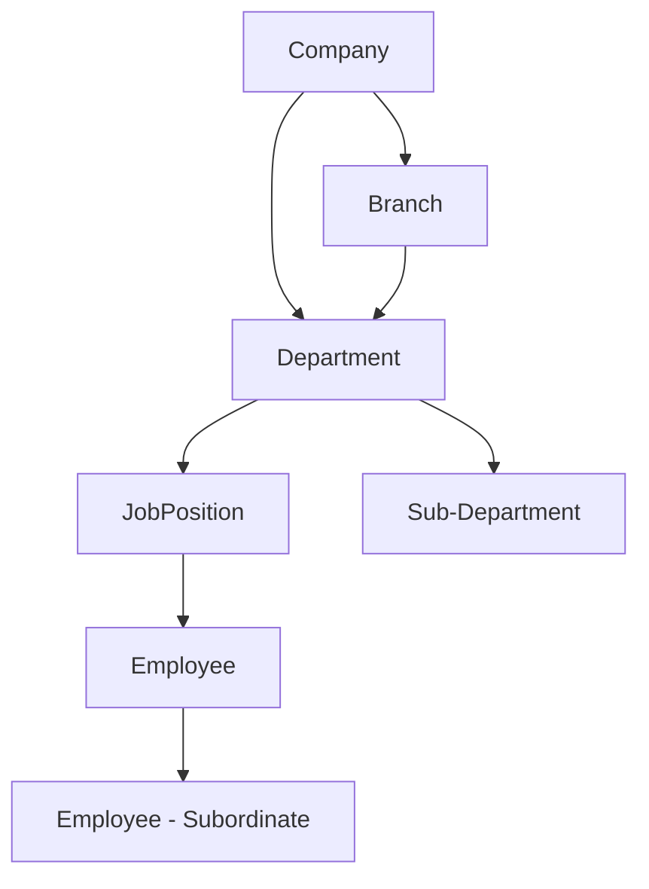

# توثيق العلاقات بين النماذج - نظام الموارد البشرية

## نظرة عامة على العلاقات

يتكون نظام الموارد البشرية من شبكة معقدة من العلاقات بين النماذج المختلفة. هذا التوثيق يوضح جميع العلاقات وكيفية عملها.

## العلاقات الأساسية (Core Relationships)

### 1. الهيكل التنظيمي الهرمي



#### Company → Branch (1:N)
```python
# في نموذج Branch
company = models.ForeignKey(
    'Company',
    on_delete=models.CASCADE,
    related_name='branches',
    verbose_name=_("الشركة")
)

# الاستخدام
company = Company.objects.get(id=company_id)
branches = company.branches.all()  # جميع فروع الشركة
active_branches = company.branches.filter(is_active=True)  # الفروع النشطة
```

#### Company → Department (1:N)
```python
# في نموذج Department
company = models.ForeignKey(
    'Company',
    on_delete=models.CASCADE,
    related_name='departments',
    verbose_name=_("الشركة")
)

# الاستخدام
company_departments = company.departments.all()
main_departments = company.departments.filter(parent_department__isnull=True)
```

#### Branch → Department (1:N) - اختيارية
```python
# في نموذج Department
branch = models.ForeignKey(
    'Branch',
    on_delete=models.CASCADE,
    related_name='departments',
    null=True,
    blank=True,
    verbose_name=_("الفرع")
)

# الاستخدام
branch_departments = branch.departments.all()
```

#### Department → JobPosition (1:N)
```python
# في نموذج JobPosition
department = models.ForeignKey(
    'Department',
    on_delete=models.CASCADE,
    related_name='job_positions',
    verbose_name=_("القسم")
)

# الاستخدام
department_jobs = department.job_positions.filter(is_active=True)
available_positions = department.job_positions.filter(
    current_headcount__lt=models.F('max_headcount')
)
```

#### JobPosition → Employee (1:N)
```python
# في نموذج Employee
job_position = models.ForeignKey(
    'JobPosition',
    on_delete=models.SET_NULL,
    null=True,
    blank=True,
    related_name='employees',
    verbose_name=_("الوظيفة")
)

# الاستخدام
position_employees = job_position.employees.filter(status='active')
```

### 2. العلاقات الذاتية (Self-Referencing)

#### Department → Department (الأقسام الفرعية)
```python
# في نموذج Department
parent_department = models.ForeignKey(
    'self',
    on_delete=models.CASCADE,
    null=True,
    blank=True,
    related_name='sub_departments',
    verbose_name=_("القسم الأب")
)

# الاستخدام
main_department = Department.objects.get(id=dept_id)
sub_departments = main_department.sub_departments.all()

# الحصول على جميع الأقسام الفرعية بشكل تكراري
def get_all_sub_departments(department):
    sub_departments = []
    for sub_dept in department.sub_departments.filter(is_active=True):
        sub_departments.append(sub_dept)
        sub_departments.extend(get_all_sub_departments(sub_dept))
    return sub_departments
```

#### Employee → Employee (المدير-المرؤوس)
```python
# في نموذج Employee
manager = models.ForeignKey(
    'self',
    on_delete=models.SET_NULL,
    null=True,
    blank=True,
    related_name='subordinates',
    verbose_name=_("المدير المباشر")
)

# الاستخدام
manager = Employee.objects.get(id=manager_id)
direct_reports = manager.subordinates.filter(status='active')

# الحصول على جميع المرؤوسين بشكل تكراري
def get_all_subordinates(manager):
    subordinates = []
    for direct_report in manager.subordinates.filter(status='active'):
        subordinates.append(direct_report)
        subordinates.extend(get_all_subordinates(direct_report))
    return subordinates
```

#### JobPosition → JobPosition (التسلسل الوظيفي)
```python
# في نموذج JobPosition
reports_to = models.ForeignKey(
    'self',
    on_delete=models.SET_NULL,
    null=True,
    blank=True,
    related_name='subordinate_positions',
    verbose_name=_("يرفع تقارير إلى")
)

# الاستخدام
senior_position = JobPosition.objects.get(id=position_id)
junior_positions = senior_position.subordinate_positions.all()
```

## العلاقات الوظيفية (Functional Relationships)

### 3. علاقات الحضور والوقت

#### Employee → AttendanceRecord (1:N)
```python
# في نموذج AttendanceRecord
employee = models.ForeignKey(
    'Employee',
    on_delete=models.CASCADE,
    related_name='attendance_records',
    verbose_name=_("الموظف")
)

# الاستخدام
employee = Employee.objects.get(id=employee_id)
today_attendance = employee.attendance_records.filter(date=timezone.now().date())
monthly_attendance = employee.attendance_records.filter(
    date__year=2024,
    date__month=1
)
```

#### AttendanceMachine → AttendanceRecord (1:N)
```python
# في نموذج AttendanceRecord
machine = models.ForeignKey(
    'AttendanceMachine',
    on_delete=models.SET_NULL,
    null=True,
    related_name='attendance_records',
    verbose_name=_("جهاز الحضور")
)

# الاستخدام
machine = AttendanceMachine.objects.get(id=machine_id)
machine_records = machine.attendance_records.filter(date=timezone.now().date())
```

#### WorkShift → EmployeeShiftAssignment (1:N)
```python
# في نموذج EmployeeShiftAssignment
work_shift = models.ForeignKey(
    'WorkShift',
    on_delete=models.CASCADE,
    related_name='employee_assignments',
    verbose_name=_("الوردية")
)

employee = models.ForeignKey(
    'Employee',
    on_delete=models.CASCADE,
    related_name='shift_assignments',
    verbose_name=_("الموظف")
)

# الاستخدام
shift = WorkShift.objects.get(id=shift_id)
shift_employees = shift.employee_assignments.filter(is_active=True)

employee = Employee.objects.get(id=employee_id)
current_shift = employee.shift_assignments.filter(
    is_active=True,
    effective_date__lte=timezone.now().date()
).first()
```

### 4. علاقات الإجازات

#### Employee → LeaveRequest (1:N)
```python
# في نموذج LeaveRequest
employee = models.ForeignKey(
    'Employee',
    on_delete=models.CASCADE,
    related_name='leave_requests',
    verbose_name=_("الموظف")
)

# الاستخدام
employee = Employee.objects.get(id=employee_id)
pending_leaves = employee.leave_requests.filter(status='pending')
approved_leaves = employee.leave_requests.filter(status='approved')
current_year_leaves = employee.leave_requests.filter(
    start_date__year=timezone.now().year
)
```

#### LeaveType → LeaveRequest (1:N)
```python
# في نموذج LeaveRequest
leave_type = models.ForeignKey(
    'LeaveType',
    on_delete=models.CASCADE,
    related_name='requests',
    verbose_name=_("نوع الإجازة")
)

# الاستخدام
leave_type = LeaveType.objects.get(id=leave_type_id)
type_requests = leave_type.requests.filter(status='approved')
```

#### Employee → LeaveBalance (1:N)
```python
# في نموذج LeaveBalance
employee = models.ForeignKey(
    'Employee',
    on_delete=models.CASCADE,
    related_name='leave_balances',
    verbose_name=_("الموظف")
)

leave_type = models.ForeignKey(
    'LeaveType',
    on_delete=models.CASCADE,
    related_name='employee_balances',
    verbose_name=_("نوع الإجازة")
)

# الاستخدام
employee = Employee.objects.get(id=employee_id)
employee_balances = employee.leave_balances.all()
annual_leave_balance = employee.leave_balances.filter(
    leave_type__code='ANNUAL'
).first()
```

### 5. علاقات الرواتب

#### Company → SalaryComponent (1:N)
```python
# في نموذج SalaryComponent
company = models.ForeignKey(
    'Company',
    on_delete=models.CASCADE,
    related_name='salary_components',
    verbose_name=_("الشركة")
)

# الاستخدام
company = Company.objects.get(id=company_id)
earnings = company.salary_components.filter(component_type='earning')
deductions = company.salary_components.filter(component_type='deduction')
```

#### Employee → EmployeeSalaryStructure (1:N)
```python
# في نموذج EmployeeSalaryStructure
employee = models.ForeignKey(
    'Employee',
    on_delete=models.CASCADE,
    related_name='salary_structure',
    verbose_name=_("الموظف")
)

salary_component = models.ForeignKey(
    'SalaryComponent',
    on_delete=models.CASCADE,
    related_name='employee_assignments',
    verbose_name=_("مكون الراتب")
)

# الاستخدام
employee = Employee.objects.get(id=employee_id)
employee_salary_components = employee.salary_structure.filter(is_active=True)
basic_salary = employee.salary_structure.filter(
    salary_component__code='BASIC'
).first()
```

## العلاقات المساعدة (Supporting Relationships)

### 6. علاقات الوثائق والملفات

#### Employee → EmployeeDocument (1:N)
```python
# في نموذج EmployeeDocument
employee = models.ForeignKey(
    'Employee',
    on_delete=models.CASCADE,
    related_name='documents',
    verbose_name=_("الموظف")
)

# الاستخدام
employee = Employee.objects.get(id=employee_id)
employee_documents = employee.documents.filter(is_active=True)
expiring_documents = employee.documents.filter(
    expiry_date__lte=timezone.now().date() + timedelta(days=30)
)
```

#### Employee → EmployeeEmergencyContact (1:N)
```python
# في نموذج EmployeeEmergencyContact
employee = models.ForeignKey(
    'Employee',
    on_delete=models.CASCADE,
    related_name='emergency_contacts',
    verbose_name=_("الموظف")
)

# الاستخدام
employee = Employee.objects.get(id=employee_id)
primary_contact = employee.emergency_contacts.filter(is_primary=True).first()
all_contacts = employee.emergency_contacts.filter(is_active=True)
```

### 7. علاقات التدريب والتطوير

#### Employee → EmployeeTraining (1:N)
```python
# في نموذج EmployeeTraining
employee = models.ForeignKey(
    'Employee',
    on_delete=models.CASCADE,
    related_name='trainings',
    verbose_name=_("الموظف")
)

# الاستخدام
employee = Employee.objects.get(id=employee_id)
completed_trainings = employee.trainings.filter(status='completed')
upcoming_trainings = employee.trainings.filter(
    start_date__gte=timezone.now().date()
)
```

## العلاقات المتقدمة (Advanced Relationships)

### 8. العلاقات Many-to-Many

#### Employee ↔ Project (N:N) - عبر نموذج وسيط
```python
# نموذج وسيط
class EmployeeProjectAssignment(models.Model):
    employee = models.ForeignKey('Employee', on_delete=models.CASCADE)
    project = models.ForeignKey('Project', on_delete=models.CASCADE)
    role = models.CharField(max_length=100, verbose_name=_("الدور"))
    start_date = models.DateField(verbose_name=_("تاريخ البداية"))
    end_date = models.DateField(null=True, verbose_name=_("تاريخ النهاية"))
    allocation_percentage = models.DecimalField(max_digits=5, decimal_places=2, verbose_name=_("نسبة التخصيص"))

# في نموذج Employee
projects = models.ManyToManyField(
    'Project',
    through='EmployeeProjectAssignment',
    related_name='team_members'
)

# الاستخدام
employee = Employee.objects.get(id=employee_id)
current_projects = employee.projects.filter(
    employeeprojectassignment__end_date__isnull=True
)
```

### 9. العلاقات الشرطية (Conditional Relationships)

#### Employee → User (1:1) - اختيارية
```python
# في نموذج Employee
user_account = models.OneToOneField(
    settings.AUTH_USER_MODEL,
    on_delete=models.SET_NULL,
    null=True,
    blank=True,
    related_name='employee_profile',
    verbose_name=_("حساب المستخدم")
)

# الاستخدام
employee = Employee.objects.get(id=employee_id)
if employee.user_account:
    user_permissions = employee.user_account.user_permissions.all()
```

## استعلامات العلاقات المعقدة

### 1. استعلامات متعددة المستويات
```python
# الحصول على جميع موظفي الشركة مع تفاصيل الأقسام والوظائف
employees = Employee.objects.select_related(
    'company',
    'branch',
    'department',
    'job_position',
    'manager'
).filter(
    company_id=company_id,
    status='active'
)

# الحصول على موظفين مع سجلات الحضور الشهرية
employees_with_attendance = Employee.objects.prefetch_related(
    Prefetch(
        'attendance_records',
        queryset=AttendanceRecord.objects.filter(
            date__year=2024,
            date__month=1
        )
    )
).filter(status='active')
```

### 2. استعلامات التجميع عبر العلاقات
```python
# إحصائيات الموظفين حسب القسم
department_stats = Department.objects.annotate(
    total_employees=Count('employees', filter=Q(employees__status='active')),
    avg_salary=Avg('employees__basic_salary'),
    total_attendance_today=Count(
        'employees__attendance_records',
        filter=Q(employees__attendance_records__date=timezone.now().date())
    )
)

# إحصائيات الإجازات حسب النوع
leave_stats = LeaveType.objects.annotate(
    total_requests=Count('requests'),
    approved_requests=Count('requests', filter=Q(requests__status='approved')),
    pending_requests=Count('requests', filter=Q(requests__status='pending'))
)
```

### 3. استعلامات البحث المتقدم
```python
# البحث في الموظفين مع معلومات مرتبطة
search_results = Employee.objects.select_related(
    'department',
    'job_position'
).filter(
    Q(full_name__icontains=search_term) |
    Q(employee_number__icontains=search_term) |
    Q(email__icontains=search_term) |
    Q(department__name__icontains=search_term) |
    Q(job_position__title__icontains=search_term)
).distinct()
```

## أفضل الممارسات للعلاقات

### 1. استخدام select_related و prefetch_related
```python
# للعلاقات ForeignKey و OneToOne
employees = Employee.objects.select_related(
    'department',
    'job_position',
    'manager'
)

# للعلاقات ManyToMany و Reverse ForeignKey
employees = Employee.objects.prefetch_related(
    'attendance_records',
    'leave_requests',
    'documents'
)
```

### 2. تجنب N+1 Query Problem
```python
# خطأ - يسبب N+1 queries
departments = Department.objects.all()
for dept in departments:
    print(dept.employees.count())  # استعلام إضافي لكل قسم

# صحيح - استعلام واحد
departments = Department.objects.annotate(
    employee_count=Count('employees')
)
for dept in departments:
    print(dept.employee_count)
```

### 3. استخدام Prefetch للتحكم في الاستعلامات
```python
from django.db.models import Prefetch

# تحديد استعلام مخصص للعلاقة
employees = Employee.objects.prefetch_related(
    Prefetch(
        'attendance_records',
        queryset=AttendanceRecord.objects.filter(
            date__gte=timezone.now().date() - timedelta(days=30)
        ).order_by('-date')
    )
)
```

هذا التوثيق يوفر فهماً شاملاً لجميع العلاقات في نظام الموارد البشرية وكيفية استخدامها بكفاءة.