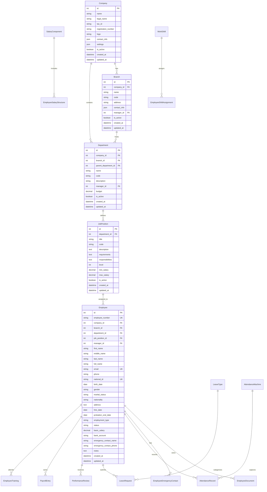

# HRMS Database Schema Design
## Comprehensive Database Architecture for ElDawliya HRMS

### Schema Overview

The HRMS database is designed with the following principles:
- **Normalization**: 3NF compliance with performance optimization
- **Scalability**: Support for multiple companies and thousands of employees
- **Integrity**: Strong referential integrity and data validation
- **Performance**: Strategic indexing and query optimization
- **Security**: Role-based access and data encryption

### Entity Relationship Diagram



### Core Tables Structure

#### 1. Organizational Structure

##### Company Table
```sql
CREATE TABLE hrms_company (
    id SERIAL PRIMARY KEY,
    name VARCHAR(200) NOT NULL,
    legal_name VARCHAR(200),
    tax_id VARCHAR(50) UNIQUE,
    registration_number VARCHAR(50),
    logo VARCHAR(255),
    contact_info JSONB,
    settings JSONB,
    is_active BOOLEAN DEFAULT TRUE,
    created_at TIMESTAMP DEFAULT CURRENT_TIMESTAMP,
    updated_at TIMESTAMP DEFAULT CURRENT_TIMESTAMP
);
```

##### Branch Table
```sql
CREATE TABLE hrms_branch (
    id SERIAL PRIMARY KEY,
    company_id INTEGER REFERENCES hrms_company(id),
    name VARCHAR(200) NOT NULL,
    code VARCHAR(20) UNIQUE,
    address TEXT,
    contact_info JSONB,
    manager_id INTEGER REFERENCES hrms_employee(id),
    is_active BOOLEAN DEFAULT TRUE,
    created_at TIMESTAMP DEFAULT CURRENT_TIMESTAMP,
    updated_at TIMESTAMP DEFAULT CURRENT_TIMESTAMP
);
```

##### Department Table
```sql
CREATE TABLE hrms_department (
    id SERIAL PRIMARY KEY,
    company_id INTEGER REFERENCES hrms_company(id),
    branch_id INTEGER REFERENCES hrms_branch(id),
    parent_department_id INTEGER REFERENCES hrms_department(id),
    name VARCHAR(200) NOT NULL,
    code VARCHAR(20) UNIQUE,
    description TEXT,
    manager_id INTEGER REFERENCES hrms_employee(id),
    budget DECIMAL(15,2),
    is_active BOOLEAN DEFAULT TRUE,
    created_at TIMESTAMP DEFAULT CURRENT_TIMESTAMP,
    updated_at TIMESTAMP DEFAULT CURRENT_TIMESTAMP
);
```

##### Job Position Table
```sql
CREATE TABLE hrms_job_position (
    id SERIAL PRIMARY KEY,
    department_id INTEGER REFERENCES hrms_department(id),
    title VARCHAR(200) NOT NULL,
    code VARCHAR(20) UNIQUE,
    description TEXT,
    requirements TEXT,
    responsibilities TEXT,
    level INTEGER DEFAULT 1,
    min_salary DECIMAL(12,2),
    max_salary DECIMAL(12,2),
    is_active BOOLEAN DEFAULT TRUE,
    created_at TIMESTAMP DEFAULT CURRENT_TIMESTAMP,
    updated_at TIMESTAMP DEFAULT CURRENT_TIMESTAMP
);
```

#### 2. Employee Management

##### Employee Table
```sql
CREATE TABLE hrms_employee (
    id SERIAL PRIMARY KEY,
    employee_number VARCHAR(20) UNIQUE NOT NULL,
    company_id INTEGER REFERENCES hrms_company(id),
    branch_id INTEGER REFERENCES hrms_branch(id),
    department_id INTEGER REFERENCES hrms_department(id),
    job_position_id INTEGER REFERENCES hrms_job_position(id),
    manager_id INTEGER REFERENCES hrms_employee(id),
    first_name VARCHAR(100) NOT NULL,
    middle_name VARCHAR(100),
    last_name VARCHAR(100) NOT NULL,
    full_name VARCHAR(300),
    email VARCHAR(255) UNIQUE,
    phone VARCHAR(20),
    national_id VARCHAR(50) UNIQUE,
    birth_date DATE,
    gender VARCHAR(10),
    marital_status VARCHAR(20),
    nationality VARCHAR(50),
    address TEXT,
    hire_date DATE NOT NULL,
    probation_end_date DATE,
    employment_type VARCHAR(20),
    status VARCHAR(20) DEFAULT 'active',
    basic_salary DECIMAL(12,2),
    bank_account VARCHAR(50),
    emergency_contact_name VARCHAR(200),
    emergency_contact_phone VARCHAR(20),
    notes TEXT,
    created_at TIMESTAMP DEFAULT CURRENT_TIMESTAMP,
    updated_at TIMESTAMP DEFAULT CURRENT_TIMESTAMP
);
```

##### Employee Document Table
```sql
CREATE TABLE hrms_employee_document (
    id SERIAL PRIMARY KEY,
    employee_id INTEGER REFERENCES hrms_employee(id),
    document_type VARCHAR(50) NOT NULL,
    title VARCHAR(200) NOT NULL,
    file_path VARCHAR(500),
    file_size INTEGER,
    mime_type VARCHAR(100),
    issue_date DATE,
    expiry_date DATE,
    is_verified BOOLEAN DEFAULT FALSE,
    notes TEXT,
    created_at TIMESTAMP DEFAULT CURRENT_TIMESTAMP,
    updated_at TIMESTAMP DEFAULT CURRENT_TIMESTAMP
);
```

#### 3. Attendance Management

##### Work Shift Table
```sql
CREATE TABLE hrms_work_shift (
    id SERIAL PRIMARY KEY,
    name VARCHAR(100) NOT NULL,
    start_time TIME NOT NULL,
    end_time TIME NOT NULL,
    break_duration INTEGER DEFAULT 0,
    weekly_hours DECIMAL(5,2),
    is_active BOOLEAN DEFAULT TRUE,
    created_at TIMESTAMP DEFAULT CURRENT_TIMESTAMP,
    updated_at TIMESTAMP DEFAULT CURRENT_TIMESTAMP
);
```

##### Attendance Record Table
```sql
CREATE TABLE hrms_attendance_record (
    id SERIAL PRIMARY KEY,
    employee_id INTEGER REFERENCES hrms_employee(id),
    record_date DATE NOT NULL,
    record_time TIME NOT NULL,
    record_type VARCHAR(10) NOT NULL,
    source VARCHAR(20) DEFAULT 'machine',
    machine_id INTEGER REFERENCES hrms_attendance_machine(id),
    notes TEXT,
    created_at TIMESTAMP DEFAULT CURRENT_TIMESTAMP,
    updated_at TIMESTAMP DEFAULT CURRENT_TIMESTAMP
);
```

#### 4. Leave Management

##### Leave Type Table
```sql
CREATE TABLE hrms_leave_type (
    id SERIAL PRIMARY KEY,
    name VARCHAR(100) NOT NULL,
    code VARCHAR(20) UNIQUE,
    description TEXT,
    max_days_per_year INTEGER,
    carry_forward_allowed BOOLEAN DEFAULT FALSE,
    requires_approval BOOLEAN DEFAULT TRUE,
    is_paid BOOLEAN DEFAULT TRUE,
    is_active BOOLEAN DEFAULT TRUE,
    created_at TIMESTAMP DEFAULT CURRENT_TIMESTAMP,
    updated_at TIMESTAMP DEFAULT CURRENT_TIMESTAMP
);
```

##### Leave Request Table
```sql
CREATE TABLE hrms_leave_request (
    id SERIAL PRIMARY KEY,
    employee_id INTEGER REFERENCES hrms_employee(id),
    leave_type_id INTEGER REFERENCES hrms_leave_type(id),
    start_date DATE NOT NULL,
    end_date DATE NOT NULL,
    days_requested INTEGER NOT NULL,
    reason TEXT,
    status VARCHAR(20) DEFAULT 'pending',
    approved_by INTEGER REFERENCES hrms_employee(id),
    approved_at TIMESTAMP,
    created_at TIMESTAMP DEFAULT CURRENT_TIMESTAMP,
    updated_at TIMESTAMP DEFAULT CURRENT_TIMESTAMP
);
```

### Indexes and Constraints

#### Performance Indexes
```sql
-- Employee indexes
CREATE INDEX idx_employee_number ON hrms_employee(employee_number);
CREATE INDEX idx_employee_email ON hrms_employee(email);
CREATE INDEX idx_employee_department ON hrms_employee(department_id);
CREATE INDEX idx_employee_status ON hrms_employee(status);

-- Attendance indexes
CREATE INDEX idx_attendance_employee_date ON hrms_attendance_record(employee_id, record_date);
CREATE INDEX idx_attendance_date ON hrms_attendance_record(record_date);

-- Leave indexes
CREATE INDEX idx_leave_employee ON hrms_leave_request(employee_id);
CREATE INDEX idx_leave_dates ON hrms_leave_request(start_date, end_date);
```

#### Data Integrity Constraints
```sql
-- Employee constraints
ALTER TABLE hrms_employee ADD CONSTRAINT chk_employee_hire_date 
    CHECK (hire_date <= CURRENT_DATE);
ALTER TABLE hrms_employee ADD CONSTRAINT chk_employee_salary 
    CHECK (basic_salary >= 0);

-- Leave constraints
ALTER TABLE hrms_leave_request ADD CONSTRAINT chk_leave_dates 
    CHECK (end_date >= start_date);
ALTER TABLE hrms_leave_request ADD CONSTRAINT chk_leave_days 
    CHECK (days_requested > 0);
```

### Migration Strategy

1. **Backup Current Data**: Complete backup of existing HR data
2. **Schema Migration**: Create new tables alongside existing ones
3. **Data Migration**: Migrate data with validation and transformation
4. **Testing Phase**: Comprehensive testing with migrated data
5. **Cutover**: Switch to new schema with minimal downtime
6. **Cleanup**: Remove old tables after successful validation

### Next Steps

1. Review and approve schema design
2. Create Django models based on this schema
3. Generate migration files
4. Implement data migration scripts
5. Begin core model development

---
*This schema provides the foundation for a scalable, professional HRMS system.*
